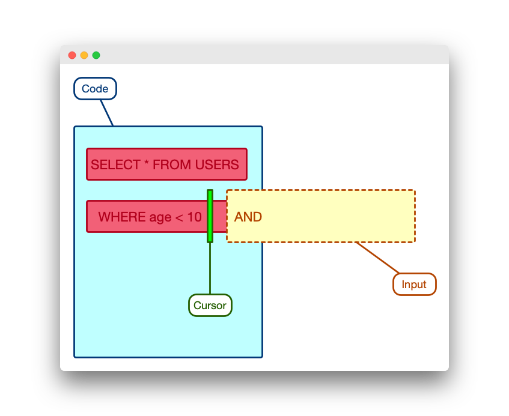
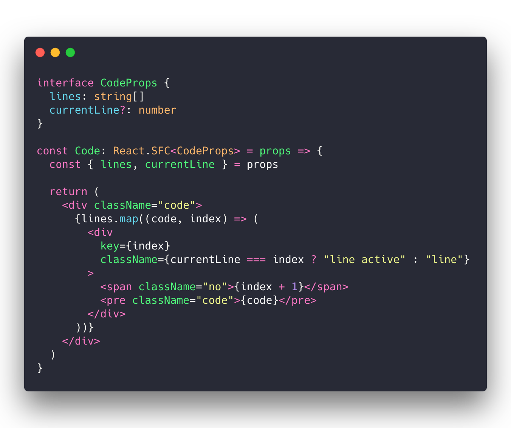
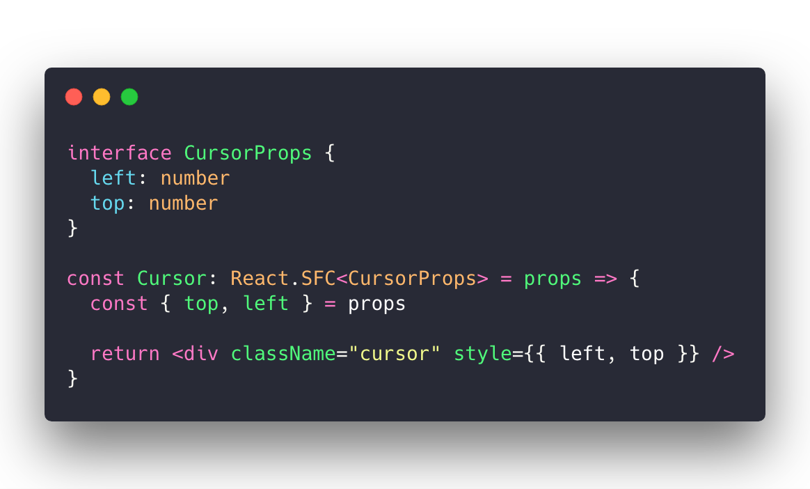
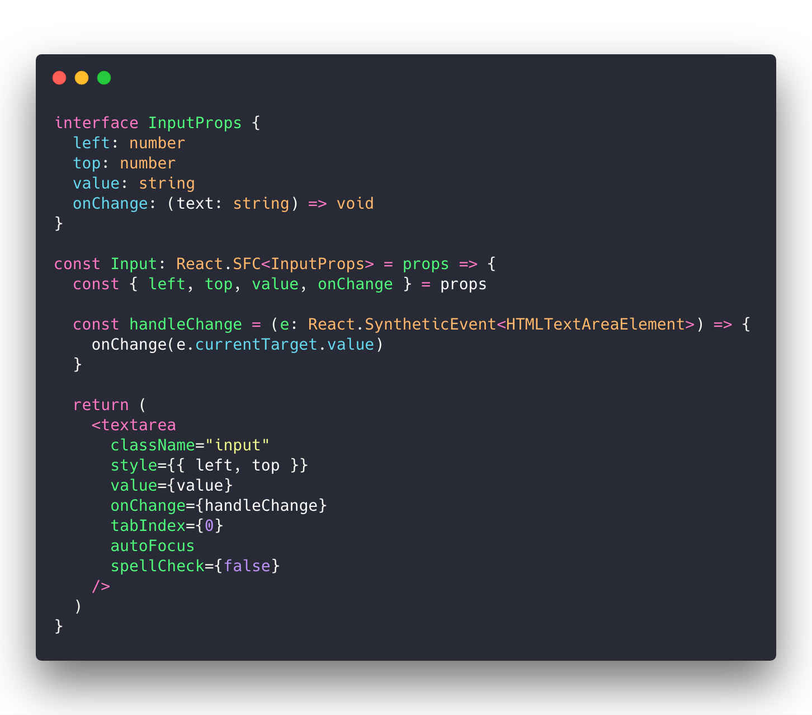
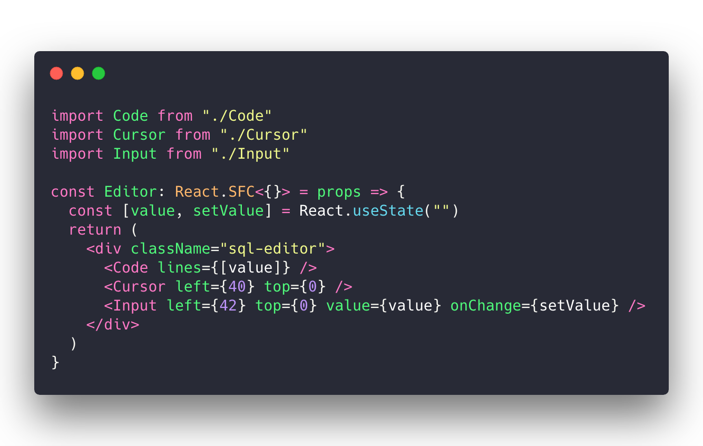
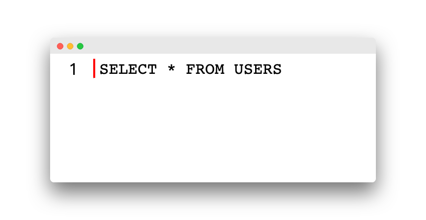

# 创建编辑器

一个简单文本编辑器（大家可以观察 CodeMirror 的实现），通常会由下面三个组件组成：

- **文本块**：展示代码，行号等
- **光标**
- **输入框**

当我们在输入框键入内容后，将会：

- 更新光标位置
- 刷新文本（这个项目里是代码块），文本按行拆分
- 刷新输入框位置，让用户感觉不到存在一个输入框，而是就像在文本上追加内容一样

综上，我们将编辑器拆分为三个组件：

- 文本组件 **Code**
- 光标组件 **Cursor**
- 输入框组件 **Input**

## 文本组件：Code

文本组件含有两个属性：

- 所有的代码行

- 当前行

  

## 光标组件：Cursor

光标组件包含了当前光标的位置信息

## 输入组件：Input

输入组件则有如下属性：

- 输入框位置信息
- 当前输入值
- onChange 事件

## 编辑器：Editor

组合这三个组件，就得到了我们的编辑器 Editor：

运行程序，尝试输入 `SELECT * FROM USERS`，你将能看到：

这基本是一个毫无卵用的编辑器，光标无法跟随，无法响应换行，也没有代码高亮等等。不过，接下来，我们会通过   RxJS 与 Hooks 一步步完善它。

> 本节的代码和示例你可以在这里查看：https://codesandbox.io/s/z6w2v1jvmx

