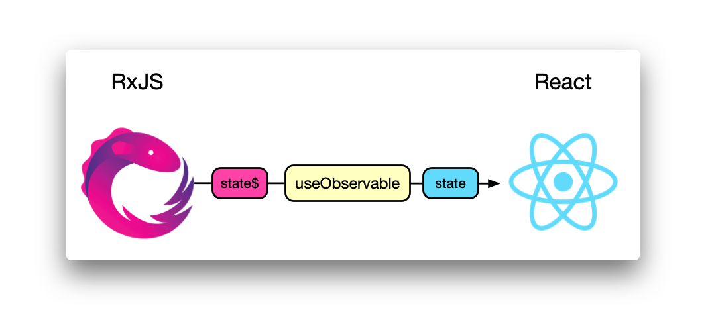
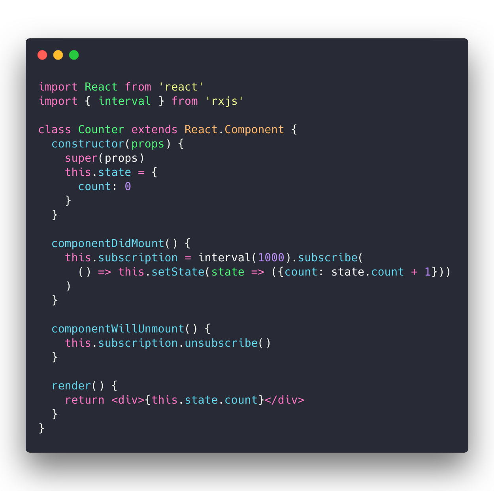
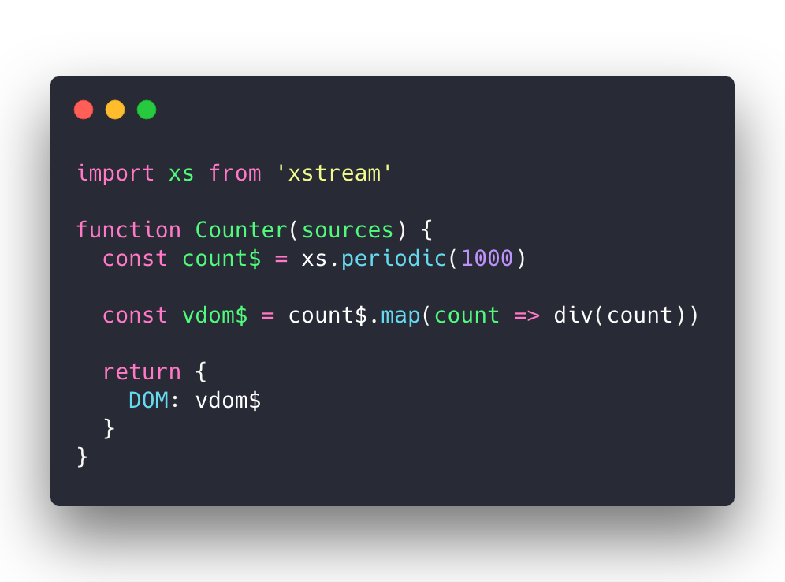
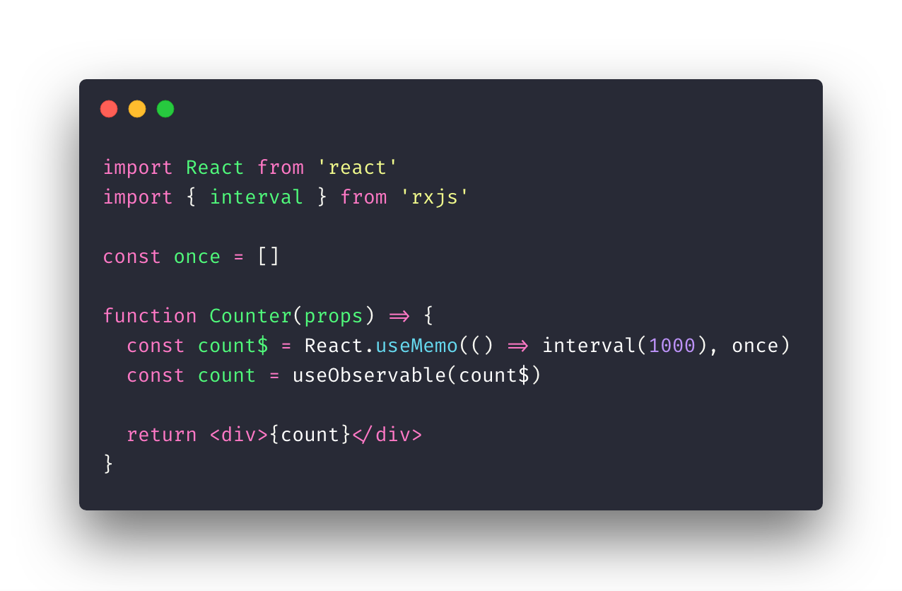
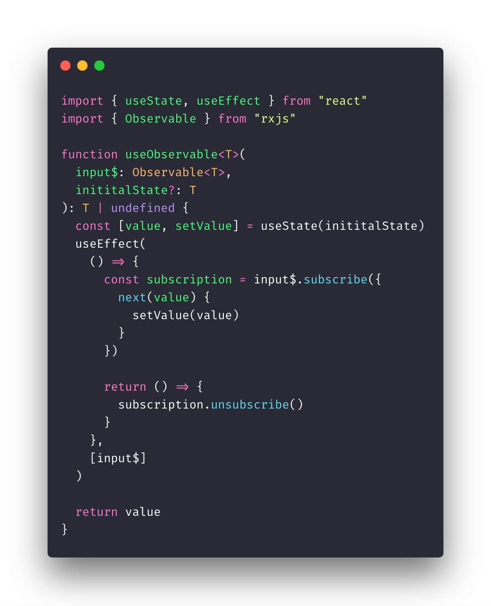

# 使用 RxJS 与 Hooks 来处理状态

我们知道，RxJS 中的 **R**，代表的单词的是 **Reactive**，即响应式的，因此，在设计哲学上，它和 React 可以说是 “同源” 的。作为一个视图层框架，React 做了单项数据流约定，规定了组件的数据源来自于 state（自身） 及 props（外部注入），帮助应用膨胀后，组件间也能有清晰的数据回路。然而，对于一个状态或者行为繁复的组件，仅仅通过 React 进行表达，就显得捉襟见肘了。这个时候，我们往往会引入额外的状态管理机制，比如 Mobx 或者 Redux，但二者大多应用于一个项目或者工程，并且更多是模式上的抽象，对于一些复杂而具体的细节，如 race condition、retry 等，并没有卓越的处理手段。

而 RxJS 则恰恰弥补了 React 这方面能力的缺失：借助于 RxJS，我们能方便构造组件状态机、及搜集组件行为，并通过 Observable 这个同一的数据结构自由地组合，实现**声明式**的状态和行为管理，从而提升组件能力及可维护性。

## RxJS 与 React 的结合

RxJS 并不是视图层框架，它和 React 并不冲突，甚至在理念上还是统一的，如果说 React 关注的是**视图和状态（view & state）**，那么 RxJS 则关注的是**时间和事件（time & event）**。因此，不需要额外的奇淫巧技，你就能在 React 中用上 RxJS：

这个组件的职责很简单，就是间隔 1 s 进行一次计数，这不是一个值得用上 RxJS 的业务场景，但能最简地反映：过去，在没有 Hooks 之前，我们是如何结合 RxJS 到 React 中的。

我们在 React 中使用 RxJS 的目的在于：

> 通过 RxJS，借道让状态变为可观测的（observable），从而使用上 RxJS 各个 operator 赋予的能力

为了达到这个目的，我们就需要：

- 在组件**挂载**后，订阅 Observable 对象
- 在组件**卸载**时，取消对 Observable 对象的订阅
- 当 Observable 对象派发出新的值时，手动变更对应的状态

事实上，用 Observable 去反映状态的变迁，几年前已经成为 [Cycle.js](https://cycle.js.org/) 的默认模式，只不过如下所示， Cycle.js 默认对视图的描述用的是 hyperscript，而不是 JSX（当然它也支持使用 JSX 去描述视图）：

对应的，我们是否能够在 React 中也那么直接使用 Observable 描述组件状态呢，而不再需要：

- 手动订阅、取消订阅 Observable
- 手动在 Observable 发出值时，设置组件状态

当 React Hooks 出来后，梦想照进现实。

## 了不起的 Hooks

关于什么是 Hooks，无论是 React 团队，还是其他开发者，已经有了详尽的阐述了，本文就不重复这方面的工作了（你若想从头了解 Hooks，那么去追一下 Dan Abramov [个人博客](https://overreacted.io/)上一篇篇精彩绝伦的文章吧）。但为什么说 React 在 Hooks 出来后，优雅结合 RxJS 的美梦将成为现实呢？这是因为 Hooks：

- 简化了组件生命周期的声明
- 简化了状态的取值与赋值
- Hooks 之间能形成良好的隔离性和组合性

现在，我们大可以封装一个 `useObservable` hook，开发者在函数组件中将这么使用：

这段代码，是否像极了前文 Cycle.js 的示例代码，简练优雅。Cycle.js 虽然生不逢时，但是 React 通过 Hooks 为这样优雅的模式提供了一个群众基础最广大的舞台去展示自己。

## `useObservable` 实现

实现上文中提到的 `useObservable`，无非就是

- 在组件**挂载**后，订阅 Observable 对象：我们使用 `useEffect` 来完成
- 在组件**卸载**时，取消对 Observable 对象的订阅：我们借助 `useEffect` 的返回函数来做清理工作。
- 当 Observable 对象派发出新的值时，变更对应的状态：这里将用到 `setState`。

因此，一个粗糙的实现将会是（这里我用了 TypeScript，并且支持传入初始状态）：

接下来，在我们的编辑器项目中，都将会使用 RxJS 来管理状态。

>  本节的代码和示例你可以在这里查看：https://codesandbox.io/s/k0x12294wo

