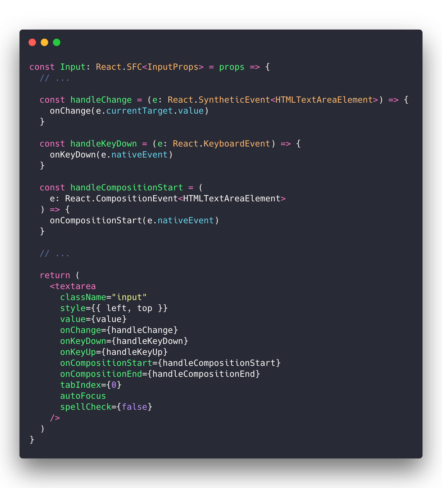

# 使用 RxJS 与 Hooks 来处理事件

与一般的 React 中事件处理不同，编辑器的事件更加复杂，包含鼠标、键盘等等，例如，现在输入框组件 Input 提供了更多的事件接口，如键盘、输入法等，以便编辑器能够完成快捷键，中文输入等功能：

而在 RxJS 的世界中，同一的数据结构（Observable）让不同的事件（键盘、鼠标、AJAX等等）能够任意组合，并派生出新的事件。编辑器恰恰是一个多种事件交织的场景：例如，我们需要组合不同的按键事件来构成快捷键；我们需要组合鼠标和键盘的事件，去决定光标位置，等等。因此，在这个项目中，除了使用 RxJS 管理状态，我们还考虑使用 RxJS 来处理事件。

假定我们的键盘按下的事件流为 `keyUp$`，一方面，我们希望能够**观察**这个流，当有键盘按下时，作出响应，另一方面，我们也要能在键盘按下时，将按下事件送入 `keyUp$` 中。换言之，`keyUp$` 具有双重身份，它既是可观察对象 `Observable` ，又是观察者 `Observer`，在 RxJS 中，具备这样双面角色的就是 [`Subject`](https://rxjs-dev.firebaseapp.com/api/index/class/Subject)。

因此，想要在 React 中使用 RxJS 进行事件管理，就需要：

- 为事件创建 `Subject` 对象
- 在事件回调中，将事件对象送入 `Subject` 中

## 使用 Subject 来管理事件

在 Editor 组件中，我们创建各个事件的 Subject，并在子组件的事件回调中，将事件送入对应的事件流中。另外，由于我们使用了函数式组件，为了避免每次函数执行时重复创建 Subject，我们还要使用 [`useMemo`](https://reactjs.org/docs/hooks-reference.html#usememo) hook：

## `useEventObservable`

上面的代码还是有些啰嗦了，我们可以将创建 Subject 以及为 Subject 对象送入值的过程封装到一个 Hooks，来减小样板代码：

这个 Hook 将返回：

- 事件对应的流
- 事件的回调句柄

现在，我们的 Editor 组件就可以简化为：

值得注意的是，现在，我们还使用了前面章节中封装的`useObservable` 来管理输入框状态。

## 总结

在这个章节中，我们：

- 了解了通过 Subject，在 React 中使用 RxJS 管控事件
- 如何封装一个 `useEventObservable` hook 来 减少样板代码

目前，我们的编辑器仍在做一些铺垫工作，它仍然没法投入使用，但我们获得了输入框的事件流，下面一节中，我们不妨就利用上获得的事件流，组合它们，实现光标闪动效果。

> 本节的代码和示例你可以在这里查看：https://codesandbox.io/s/11qnynpz3