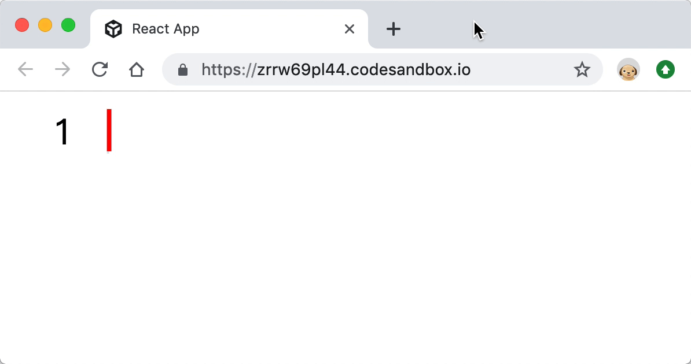
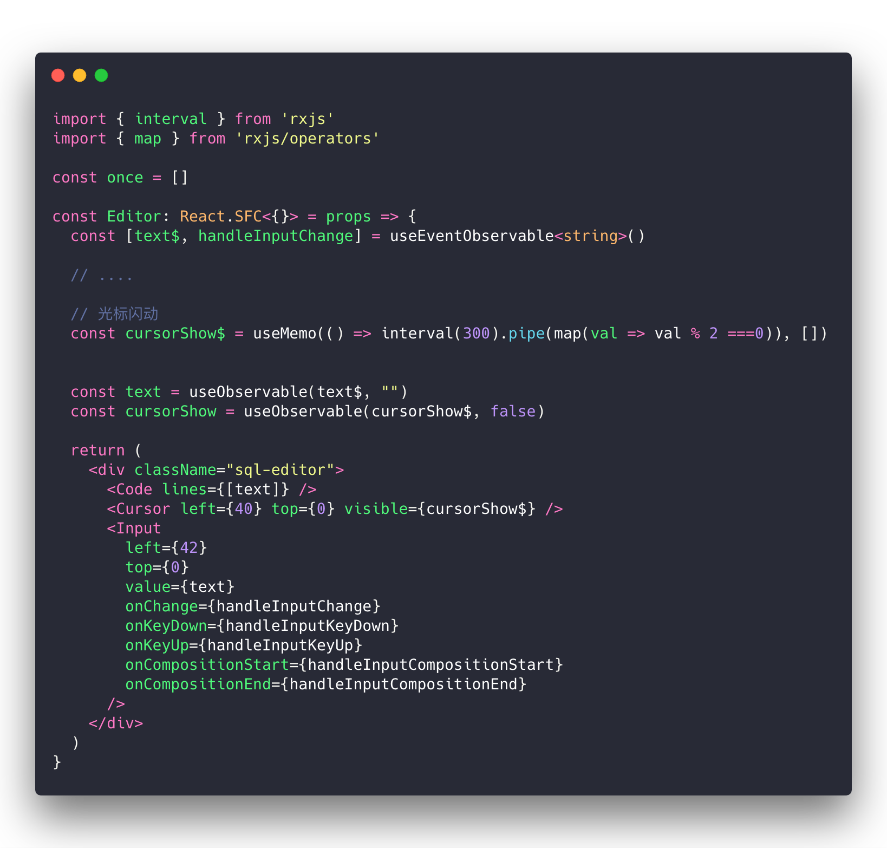
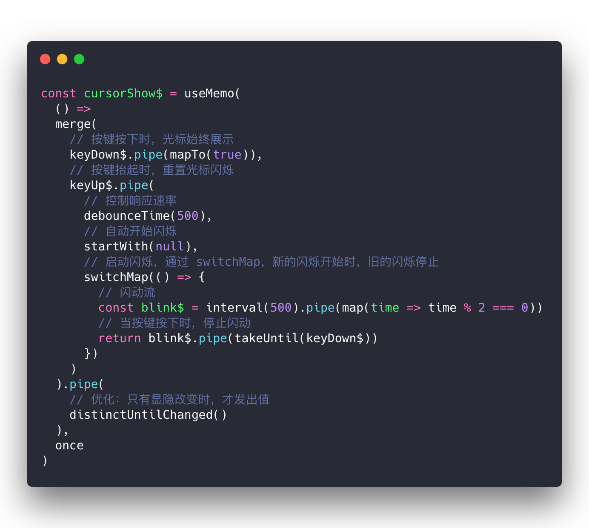

# 光标闪动

上一节中，我们封装了 `useEventObservable` ，从而能用 Observable 治理组件事件。这一节，我们不妨就用这些事件流，实现输入光标的闪动效果吧。

## 实现

在网页上实现光标闪动很简单，就是间隔一段时间修改光标组件的 `visibility` 样式，即修改光标的可见性。假定我们仅仅是通过时间来控制光标显隐藏，如每 500 ms，光标闪动一次，则我们可以在 Editor 组件中，这么描述：

## 优化

这还不够，如果你观察 VS Code 之类的编辑器，当我们进行输入的时候，光标是不会闪烁的，这能减小开发者编码时的 “噪音”。

因此，对于光标闪动，更好的描述是（每个描述我会指出它需要的 operator）：

- **按键按下**时，光标始终展示。[`mapTo`](https://www.learnrxjs.io/operators/transformation/mapto.html)

- **按键抬起**时
  - 重新开始光标闪烁，直到按键按下。[`takeUntil`](https://www.learnrxjs.io/operators/filtering/takeuntil.html)
  - 新的闪烁开始，停止上一次的闪动。[`switchMap`](https://www.learnrxjs.io/operators/transformation/switchmap.html)
  - 连续输入时，光标不闪烁，因此要控制按键抬起的响应速率。[`debounceTime`](https://www.learnrxjs.io/operators/filtering/debouncetime.html)
  - 默认自动开始一次光标闪烁。[`startWith`](https://www.learnrxjs.io/operators/combination/startwith.html)

RxJS 的**声明式**编程风格、强大的管道操作、丰富的 operator，能将我们上面的描述近乎 “原封不动” 的转换为代码：

这里，前面章节我们创建的 `keyUp$`、`keyDown$` 事件流就派上了用场。由于数据结构的同一，我们能够方便的组合这些事件、声明事件间的因果关系，从而创建出新的数据源。

读者大可以想一下，如果我们使用传统的命令式编程实现同样的逻辑，毫无疑问，将会大费周章。

现在，运行示例，你将看到开篇那样的光标闪动，而当你连续输入时，这个闪动会自动停止。

> 本节的代码和示例你可以在这里查看：https://codesandbox.io/s/zrrw69pl44

