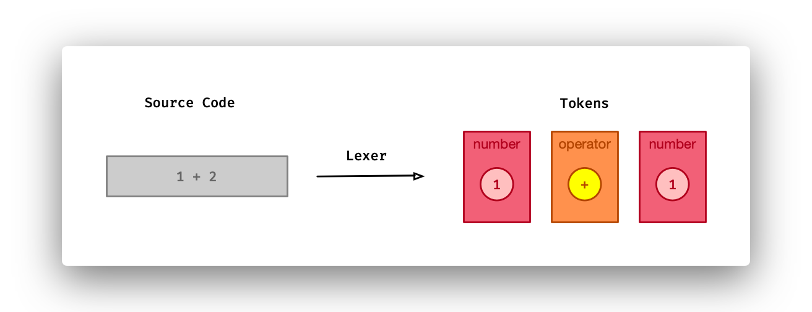
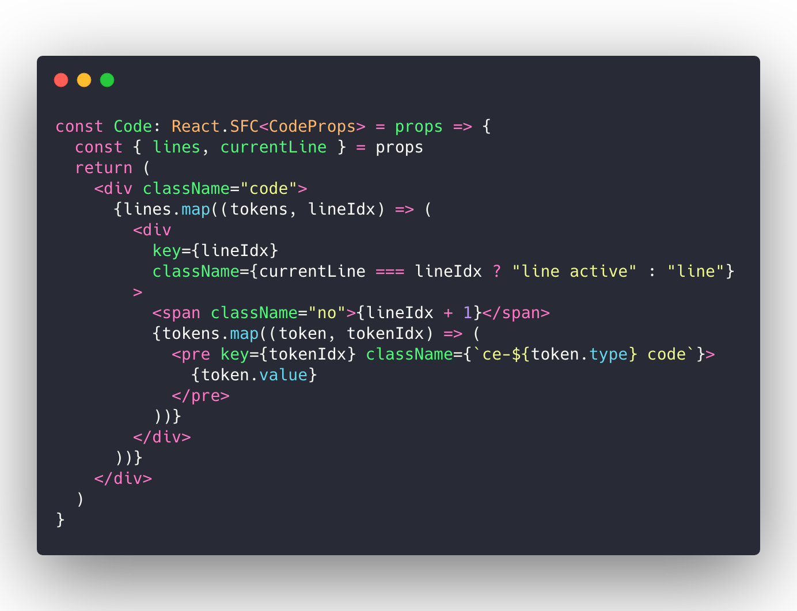
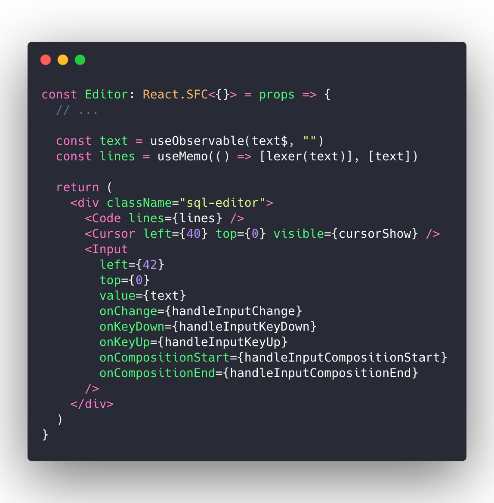
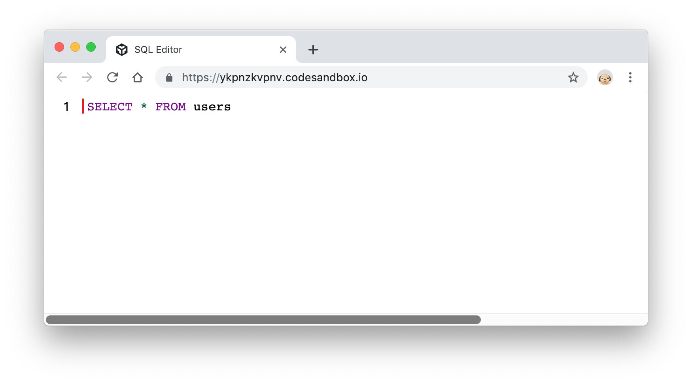

# 代码高亮

这节内容我们来为编辑器增加代码高亮。高亮代码其实完成的工作就是[词法解析(Lexical Analyzer)](),词法解析能够将源代码转换成不同类型的 token，进而我们能够为不同的 token 进行染色高亮：

现在，我们的 `<Code />` 组件在渲染代码行时，还要逐个渲染当前行中的 token：

而在我们的编辑器中，每次文本变化时，我们重新执行词法分析，获得 token：

现在，运行程序，你能在浏览器中看到我们的高亮效果了：

>  如何实现 SQL 代码的词法解析，不是本系列的重点，感性的读者可以在本节的代码示例中查看：<https://codesandbox.io/s/ykpnzkvpnv>