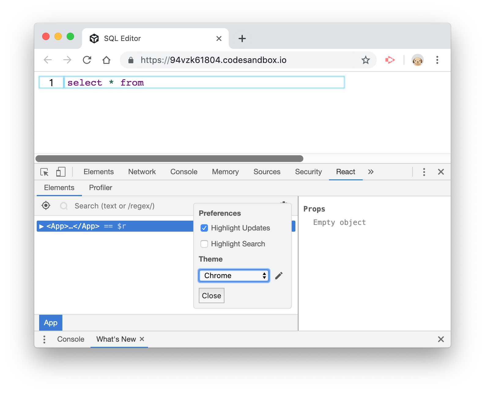
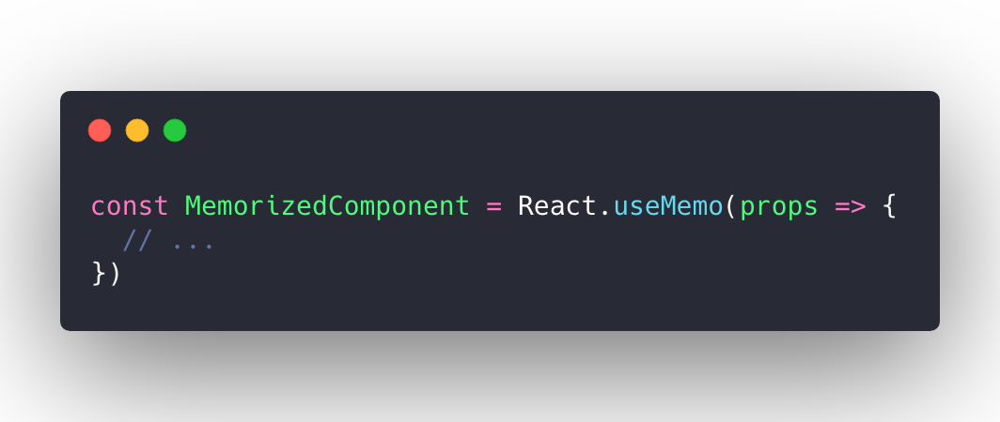

# 性能优化

我们的编辑器组件 `<Editor />` 是由三个子组件构成的，分别是代码组件 `<Code />` 、光标组件 `<Cursor />`及输入组件 `<Input />`。现在，我们看看编辑器的工作效能。除了使用 `console.log`，这里推荐为 chrome 添加 React 的 [Dev Tools](<https://chrome.google.com/webstore/detail/react-developer-tools/fmkadmapgofadopljbjfkapdkoienihi?hl=en>)，并开启 **Highlight Updates**，来观察组件的更新状况：

可以看到，虽然我们停止了输入，但光标闪动会引起 `<Editor />` 的重绘，从而导致其子组件也在光标闪动时不停重绘。

在基于 Class Component 实现的组件中，我们有 PureComponent 来控制组件绘制粒度：只有在组件的 Props 发生变动时才进行重绘。而之前的 React 是没有为函数组件提供类似机制的，但现在不同了，React 提供了 [`React.memo()`](<https://reactjs.org/docs/react-api.html#reactmemo>) 来实现对函数组件的 “缓存”：

当我们为 `<Code />`、`<Cursor />` 及  `<Input />` 都使用 `React.memo` 进行包裹后，再来看看是什么效果吧：

当我们停止输入内容后，执行更新的组件就只有 `<Cursor />` 了！

> 本节的代码和示例你可以在这里查看：https://codesandbox.io/s/94vzk61804